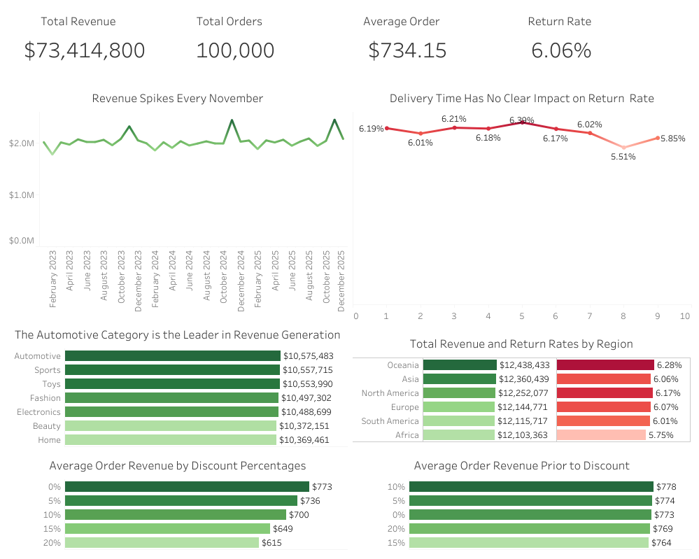

# E-Commerce Sales & Returns Analysis

## Executive Summary

This project analyzes 100,000 synthetic e-commerce transactions to evaluate revenue performance, customer purchasing behavior, product category trends, discount effectiveness, delivery efficiency, and return patterns.

Using SQL, I cleaned and analyzed the dataset, engineered key business metrics, and prepared the data for Tableau visualization. The final dashboard allows users to monitor revenue, orders, average order value, return rate, product performance, regional trends, and delivery-related return behavior.

## Business Questions

- Which product categories generate the most revenue?
- How do revenue and order volume trend over time?
- Which regions perform best by revenue and return rate?
- Are higher discounts associated with higher or lower order value?
- Does delivery time appear to influence return behavior?
- Which customers generate the highest total sales?

## Tools Used

- SQL: data cleaning, metric creation, exploratory analysis
- Tableau: dashboard development and interactive visualization
- Excel/CSV: source data review

## Dataset

- Source: [Synthetic E-Commerce Sales Dataset 2025](https://www.kaggle.com/datasets/emirhanakku/synthetic-e-commerce-sales-dataset-2025)
- Rows: 100,000
- Columns: 13

## Project Structure

/data
- synthetic_ecommerce_sales_2025.csv

/sql
- ecommerce_analysis.sql

## Key Metrics Created

- Total revenue
- Total orders
- Average order value
- Return rate
- Pre-discount order value
- Monthly revenue
- Monthly order volume
- Revenue by product category
- Return rate by delivery time
- Revenue by region
- Customer-level total spend

## SQL Techniques Used

- Aggregations using `COUNT`, `SUM`, and `AVG`
- Date formatting using `DATE_FORMAT`
- Conditional calculations
- Return rate calculations
- Customer-level grouping
- Revenue and discount analysis
- Window functions for ranking and trend analysis

## Tableau Dashboard

The Tableau dashboard includes:

- KPI cards for total revenue, total orders, average order value, and return rate
- Monthly revenue trend
- Product category revenue breakdown
- Regional revenue and return comparison
- Discount impact analysis
- Delivery time vs return rate analysis
- Interactive filters by region, category, and discount level

View the interactive dashboard on Tableau Public: [Bank Customer Churn Dashboard](https://public.tableau.com/app/profile/kevin.lim7109/viz/ecommerceanalysis_17775369074360/ecommerceanalysis)

## Key Insights

- Revenue fluctuated across the analyzed months, showing changes in customer demand over time.
- Product category performance varied significantly, indicating opportunities to prioritize high-revenue categories.
- Higher discount levels were associated with lower average revenue per order, suggesting discounts may not always increase order value.
- Delivery time did not show a clear relationship with return rate, meaning other factors may better explain customer returns.
- Regional revenue and return behavior varied, suggesting region-specific sales and return strategies may be useful.

## Recommendations

- Focus marketing and inventory planning around the highest-revenue product categories.
- Review discount strategy to determine whether high discount levels are reducing order value without improving customer behavior.
- Investigate return behavior by product category and customer rating, since delivery time alone does not appear to explain returns.
- Use regional performance differences to tailor promotions, shipping policies, or product assortment by market.

## Limitations

- The dataset is synthetic, so findings should be treated as practice analysis rather than real business conclusions.
- The analysis is descriptive and does not prove causation.
- Additional fields such as profit margin, shipping cost, customer acquisition channel, and product-level detail would allow deeper business analysis.
